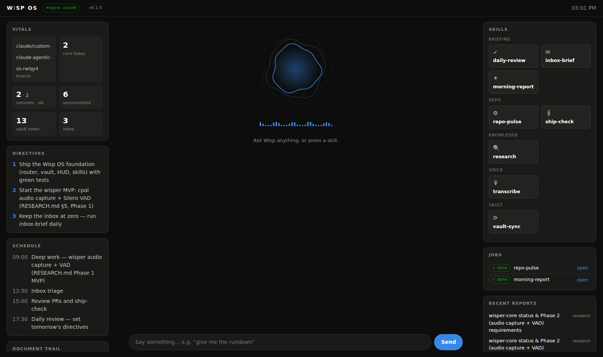
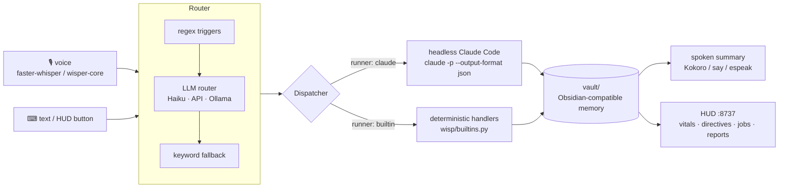

# OpenSourceWisper · Wisp OS

Two tightly-coupled projects:

- **OpenSourceWisper** — a fully local [Wispr Flow](https://wisprflow.ai) clone in Rust:
  hotkey → mic → local ASR → local LLM cleanup → clean text at your cursor. No cloud,
  strictly more private than the original. Research + phase plan: [`RESEARCH.md`](RESEARCH.md).
- **Wisp OS** — a custom **Claude Code agentic OS** layered on top of this repo,
  built from the blueprint in
  [`docs/video-notes-PW0sgog3kXY.md`](docs/video-notes-PW0sgog3kXY.md)
  ("STOP Using Claude Code Without This Fable 5 Agentic OS"): skills as the bedrock,
  a markdown vault as memory, headless Claude Code as the engine, and a HUD for
  observability.



## Wisp OS in one picture



Every stage degrades gracefully: no API key, no `claude` CLI, no microphone and no
TTS engine are all fine — routing falls back to keywords, `runner: claude` skills fall
back to builtins, voice falls back to typing, and the OS keeps working.

## Quick start

```bash
# no dependencies — Python 3.11+ stdlib only
python3 -m wisp serve            # HUD at http://127.0.0.1:8737
python3 -m wisp ask "give me the rundown"
python3 -m wisp run inbox-brief
python3 -m wisp voice            # interactive loop (mic if available, else typing)
python3 -m wisp skills           # list every registered skill
python3 -m wisp status
```

Optional local voice extras: `pip install faster-whisper sounddevice kokoro`.

## The skill system (shared with Claude Code)

Skills live in [`.claude/skills/`](.claude/skills) — one directory per skill with a
`SKILL.md`. Claude Code reads them as normal skills; Wisp OS reads the *same files* to
render HUD buttons, compile voice triggers and dispatch runs:

| Skill | Group | Runner | Say… |
|---|---|---|---|
| `morning-report` | briefing | builtin | "give me the rundown" |
| `inbox-brief` | briefing | builtin | "triage my inbox" |
| `daily-review` | briefing | builtin | "wrap up the day" |
| `vault-sync` | vault | builtin | "sync the vault" |
| `repo-pulse` | repo | builtin | "how's the repo" |
| `ship-check` | repo | builtin | "can I commit" |
| `research` | knowledge | claude | "research …" |
| `transcribe` | voice | builtin | "transcribe" |

Adding one: copy a `SKILL.md`, write trigger phrases, and either point `builtin:` at a
handler in [`wisp/builtins.py`](wisp/builtins.py) or set `runner: claude` to let
headless Claude Code execute the body as its prompt. It immediately becomes a button,
a voice command and a Claude Code skill. Conventions: [`CLAUDE.md`](CLAUDE.md).

## The vault (memory)

[`vault/`](vault) is an Obsidian-compatible markdown vault: `reports/` (skill output
with frontmatter + wikilinks), `directives/current.md` (top-3 priorities),
`inbox/` (items to triage), `schedule.md`, and `log/` (run journal + document trail).
`.claude/` hooks brief every Claude Code session with the current directives and
freshest reports, so terminal sessions, HUD clicks and voice commands share one memory.

## Layout

```
crates/wisper-core/   Rust: settings, dictionary, formatting, prompts, models, history
wisp/                 the agentic OS runtime (stdlib-only Python)
wisp/hud/index.html   the HUD (single file, no build step)
wisp/tests/           36 unit tests — python3 -m unittest discover -s wisp/tests -t .
.claude/              skills, subagents, hooks, settings (the Claude Code layer)
vault/                markdown memory
docs/                 video transcript/notes the OS was built from
```

## Testing

```bash
python3 -m unittest discover -s wisp/tests -t . -q   # Wisp OS
cargo check && cargo test                            # Rust workspace
python3 -m wisp run ship-check                       # the whole gate, as a skill
```
